# Concurrent Programming - Summer 22/23

> This document contains the relevant observations and technical documentation of the problem sets resolution.

- Student: `49428 - Francisco Engenheiro - LEIC41D`

## Table of Contents
- [Set1](#set1)
  - [NAryExchanger](#naryexchanger)
  - [BlockinMessageQueue](#blockingmessagequeue)
  - [ThreadPoolExecutor](#threadpoolexecutor)
  - [ThreadPoolExecutorWithFuture](#threadpoolexecutorwithfuture)
    - [Promise](#promise)
- [Set2](#set2)
  - [CyclicBarrier](#cyclicBarrier)
  - [ThreadSafeContainer](#threadsafecontainer)
  - [ThreadSafeCountedHolder](#threadsafecountedholder)
  - [LockFreeCompletionCombinator](#lockfreecompletioncombinator)
- [Monitor style vs Kernel style](#monitor-style-vs-kernel-style)
- [Lock-based vs Lock-free algorithms](#lock-based-vs-lock-free-algorithms)

## Set1
### NAryExchanger
[Implementation](src/main/kotlin/pt/isel/pc/problemsets/set1/NAryExchanger.kt) | [Tests](src/test/kotlin/pt/isel/pc/problemsets/set1/NAryExchangerTests.kt)

#### Description
This exchanger implementation is similar to the [Java Exchanger](https://docs.oracle.com/javase/7/docs/api/java/util/concurrent/Exchanger.html), but it allows to exchange generic values between 
an arbitrary group of threads instead of just two. It also allows for each thread to specify a willing-to-wait 
timeout for the exchange operation to complete.

The exchanger is able to create multiple groups of threads with the same specified size upon creation,
and each thread can only exchange values with the threads of its group.

A group is completed if the number of threads required to complete the group equals the specified group size.

#### Public interface:
```kotlin
class NAryExchanger<T>(groupSize: Int) {
    @Throws(InterruptedException::class)
    fun exchange(value: T, timeout: Duration): List<T>?
}
```

In the following image, an example can be seen of such iteraction between the exchanger and a set of threads.

| 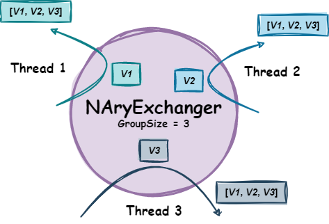 |
|:------------------------------------------------------------:|
|                   *NAryExchanger example*                    |

#### Style of synchronization: 
- For this synchronizer the `Kernel-style` or `Delegation of execution` was used in form of a `Request`, which 
represents a group in this context.
- A delegation of execution was used, because it's easier for the thread that completes the group to signal all the other threads of that group, that such condition is now true, thus completing their request, and as such, the other threads in the group aren't 
required to alter the state of the `Exchanger` or their own state when they return from *await* (as they would in `Monitor Style`).
- Also, the `Kernel-style` allows for the exchanger to keep creating new groups without keeping track of the previous ones, as the threads of each group keep a local reference to their respective request object.
- The described `Request` is defined as follows:

    ```kotlin
    private class Request<T>(
        val condition: Condition,
        val values: MutableList<T> = mutableListOf(),
        var isGroupCompleted: Boolean = false
    )
    ```

#### Normal execution:
- A thread calls `exchange` and awaits, within a timeout duration, for `groupSize` threads to call `exchange` as well.
- When `groupSize` threads have called `exchange`, the values are exchanged and the threads resume their respective work.

#### Conditions of execution:
- **Paths** - The thread can take two major paths when calling `exchange`:
    - the thread is the last thread to join the group, thus completing it, and as such, it returns with the exchanged values (***fast-path***).
    - a group is not ready to be completed, the thread passively awaits for that condition to be true (***wait-path***). 
- **Giving-up** - While waiting, a thread can *give-up* on the exchange operation if:
    - the thread is interrupted while waiting for the group to be completed and throws an `InterruptedException`.
    - the thread willing-to-wait timeout expires and returns `null`.
- **Additional notes**:
    - If a thread is interrupted but the group is completed, it will still return the exchanged values but will throw an `InterruptedException` if blocked again (since the interrupt flag is rearmed). 
    - A thread that specifies a timeout of *zero* will not wait for the group to be completed and will return `null` immediately if it did not complete the group.
  
### BlockingMessageQueue
[Implementation](src/main/kotlin/pt/isel/pc/problemsets/set1/BlockingMessageQueue.kt) | [Tests](src/test/kotlin/pt/isel/pc/problemsets/set1/BlockingMessageQueueTests.kt)

#### Description
This synchronizer is a blocking queue,
similar to an [ArrayBlockingQueue](https://docs.oracle.com/javase/7/docs/api/java/util/concurrent/ArrayBlockingQueue.html)
that allows for multiple threads to concurrently enqueue and dequeue messages.
It also allows for each thread to specify a willing-to-wait timeout for the enqueue and dequeue operations to complete.

The term *blocking* refers to the fact that the queue is bounded,
and as such, if a thread tries to enqueue a message when the queue is full,
or tries to dequeue a message when the queue is empty,
it will block until the queue is not full or not empty, respectively.

This type of synchronizer is useful when dealing in scenarios with multiple producers and consumer threads that want to exhange messages,
and as such, it is important to ensure that those messages are enqueued and dequeued in the order of arrival,
because of that the queue was implemented using FIFO (*First In First Out*) ordering.

#### Public interface:
```kotlin
class BlockingMessageQueue<T>(private val capacity: Int) {
    @Throws(InterruptedException::class)
    fun tryEnqueue(message: T, timeout: Duration): Boolean
    @Throws(InterruptedException::class)
    fun tryDequeue(nOfMessages: Int, timeout: Duration): List<T>?
}
```

In the following image, an example can be seen of the iteraction between the blocking queue and a set of producer and consumer threads.

|  |
|:---------------------------------------------------------------------------:|
|                       *BlockingMessageQueue example*                        |

#### Style of synchronization:
- For this synchronizer the `Kernel-style` or `Delegation of execution` was used in form of several `Requests`, 
which one representing a different condition:
  - `ProducerRequest` - represents a *Producer Thread* request to enqueue a message.
  
    ```kotlin
    private class ProducerRequest<T>(
        val message: T,
        val condition: Condition,
        var canEnqueue: Boolean = false
    )
    ```
  - `ConsumerRequest` - represents a *Consumer Thread* request to dequeue a set of messages.
  
    ```kotlin
    private class ConsumerRequest<T>(
        val nOfMessages: Int,
        val condition: Condition,
        var messages: List<T> = emptyList(),
        var canDequeue: Boolean = false
    )
    ```
- The delegation is used in the sense where the *Consumer thread* that dequeues the messages is the one that signals all *Producer
threads*, that were waiting to enqueue a message, and completes their request if it can be completed, because it altered the 
state of the synchronizer and because of that it might have created conditions that allow other threads to complete their requests. 
This process works in both ways, where a *Producer thread* should complete all *Consumer thread requests* if they can be completed.
- Since each thread submits a request to its respective queue, *specific signalling* is used here where the threads can signal 
each other instead of a single condition, which is more efficient because it reduces the number of threads that are woken up 
when a condition is met only to find their request is not the one that was completed.
- In this context, there's also a special case where if a *Consumer Thread* gives up, either by timeout or interruption, not
only it should remove its request from the *consumer requests queue*,
  but also it should signal all *Consumer Threads*, that were waiting to dequeue a set of messages, and complete their request if it can be completed.

The following image tries to illustrate an example of the described special delegation.

| 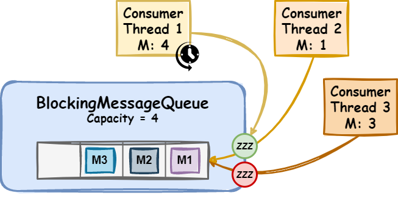 |
|:--------------------------------------------------------------------------------------------------------------------------------:|
|                                                  *Consumer Special delegation*                                                   |

In this example, **Consumer Thread 1** is waiting to dequeue 4 messages, but the *queue* only has 3 messages available.
Since no *Producer Thread* enqueued the final message to complete its request,
within the given timeout, the thread gives up.

In the process of giving up, the thread removes its request from the *consumer requests queue*,
and completes all *Consumer Thread* requests that can be completed, in this example, **Consumer Thread 2** only. 

Since delegation style was used in this synchronizer,
not doing what was described would result in an invalid state of the synchronizer,
where a ***liveliness*** property is violated,
since there are enough messages in the *message queue* to complete the request of **Consumer Thread 2**
but the thread is not signaled and subsequently its request is not completed.

We could think similarly about the *Producer Thread* requests, where if a *Producer Thread* gives up, either by timeout or interruption,
not only it should remove its request from the *producer requests queue*, but also it should signal the next *Producer Threads* in the
queue and complete their request if it could be completed.
But in this case,
it's different
because the *Producer Thread* that gave-up submitted a request that is equals to all other *Producer Thread* requests,
and as such, it cannot assume that the next *Producer Thread* request in the queue can be completed.

#### Normal execution:
- A thread calls `tryEnqueue` and expects to enqueue a message within the given timeout. 
- A thread calls `tryDequeue` and expects to dequeue a set of messages within the given timeout.

#### Conditions of execution:
`TryEnqueue`:
- **Paths** - The thread can take two major paths when calling this method:
    - **fast-path** 
        - there's a consumer thread that is waiting to dequeue a single message, and as such, the thread delivers the message directly and returns `true`.
        - the *message queue* is not full, and the thread is the head of the *producer requests queue*, the thread enqueues the message and returns `true`.
    - **wait-path** - the *message queue* is full, or the thread is not the head of the *producer requests queue*, and as such, the thread passively awaits to be able to enqueue the message.
- **Giving-up** - While waiting, a thread can *give-up* on the enqueue operation if:
    - the thread is interrupted while waiting for the queue to be not full and throws an `InterruptedException`.
    - the thread willing-to-wait timeout expires and returns `false`.
- **Additional notes**:
    - If a thread is interrupted but another thread completed this thread request to enqueue a message, it will still return `true` but will throw an `InterruptedException` if blocked again (since the interrupt flag is rearmed).
      - A thread that specifies a timeout of *zero* will not wait and will return `false` immediately if it did not enqueue the message.

`TryDequeue`:
- **Paths** - The thread can take two major paths when calling this method:
    - the *message queue* has at least `nOfMessages` messages, and the thread is the head of the *consumer requests queue*, the thread dequeues the messages and returns them (***fast-path***).
    - the *message queue* has less than `nOfMessages` messages, or the thread is not the head of the *consumer requests queue*, and as such, the thread passively awaits to be able to dequeue the messages (***wait-path***).
- **Giving-up** - While waiting, a thread can *give-up* on the dequeue operation if:
    - the thread is interrupted while waiting for the queue to be not empty and throws an `InterruptedException`.
    - the thread willing-to-wait timeout expires and returns `null`.
- **Additional notes**:
    - If a thread is interrupted but another thread completed this thread request to dequeue a set of messages, it will still return those messages, but will throw an `InterruptedException` if blocked again (since the interrupt flag is rearmed).
      - A thread that specifies a timeout of *zero* will not wait and will return `null` immediately if it did not dequeue the number of requested messages.

### ThreadPoolExecutor
[Implementation](src/main/kotlin/pt/isel/pc/problemsets/set1/ThreadPoolExecutor.kt) | [Tests](src/test/kotlin/pt/isel/pc/problemsets/set1/ThreadPoolExecutorTests.kt)

#### Description
This synchronizer is similar to the Java [ThreadPoolExecutor](https://docs.oracle.com/javase/7/docs/api/java/util/concurrent/ThreadPoolExecutor.html)
that allows outside threads to delegate the execution of a task to other threads - *worker threads* - that it manages.

The executor has a dynamic worker thread pool size from `0` to `maxThreadPoolSize`.
The worker threads are created lazily,
and as such,
when a task is delegated to the executor
and there are no available worker threads and the maximum pool size has not been reached, only then a new worker thread is created.

The tasks are executed using the 
[Runnable](https://docs.oracle.com/javase/7/docs/api/java/lang/Runnable.html) interface,
and as such, the executor does not return any value to the caller.
If no work is delegated to the executor, the worker threads will be kept alive, waiting for work, for a maximum of 
`keepAliveTime` before being terminated and removed from the pool by the executor.

#### Public interface
```kotlin
class ThreadPoolExecutor(
    private val maxThreadPoolSize: Int,
    private val keepAliveTime: Duration,
) {
    @Throws(RejectedExecutionException::class)
    fun execute(runnable: Runnable)
    fun shutdown()
    @Throws(InterruptedException::class)
    fun awaitTermination(timeout: Duration): Boolean
}
```

The following image shows how a task (**R**), that is delegated to a worker thread is executed within the thread pool.

|  |
|:------------------------------------------------------------------------:|
|                      *ThreadPoolExcecutor example*                       |

#### Style of synchronization
- In this synchronizer, the `Monitor Style` was used to synchronize the *worker threads*.
  Each thread alters the state of the 
synchronizer and doesn't delegate the alteration of that state to another thread.

#### Lifecycle
The executor has a lifecycle that can be described by the following states:

  |  |
  |:--------------------------------------------------------------------:|
  |                     *ThreadPoolExecutor states*                      |
 
- **Ready** - the executor is accepting tasks to be executed. Outside threads can delegate tasks to the thread pool using the `execute` method.
- **Shutting down** - the executor is in shutdown mode, and as such, is not accepting tasks to be executed, but it's still executing the tasks that were already delegated to it. This process is started by calling the `shutdown` method.
- **Terminated** - the thread pool has finished the shutdown process and terminates. All tasks that were delegated to it prior to the shutdown process have been executed with success or failure. An outside thread can synchronize with this termination process by calling the `awaitTermination` method.

#### Normal execution:
- A thread calls `execute` and leaves, expecting the task to be executed by a worker thread within the time limit.
- A thread calls `shutdown`, expecting the thread pool to start shutting down.
- A thread calls `awaitTermination` and awaits, for a time duration, for the thread pool to terminate.

#### Conditions of execution:
`shutdown`:
- In the first and only effective call to `shutdown` method, the executor is responsible to signal all the threads waiting,
  for more tasks to be delegated to them that the executor is shutting down, and they should clear the queue of tasks and
  terminate if no more work is available.

`awaitTermination`:
- **Paths** - The thread can take two major paths when calling this method:
    - the thread pool has already terminated, and as such, the thread returns `true` immediately (***fast-path***).
    - the thread pool hasn't terminated yet, and as such, the thread passively awaits for the thread pool to terminate (***wait-path***).
- **Giving-up** - While waiting, a thread can *give-up* on the executor shutdown operation if:
    - the thread willing-to-wait timeout expires and returns `false`.
- **Additional notes**:
    - the thread is interrupted while waiting and throws an `InterruptedException`.
    - a thread that specifies a timeout of *zero* will not wait for the executor to shut down and will return `false` immediately.
    - the last thread to terminate is also responsible to signal all the threads waiting for the executor to shut down.

### ThreadPoolExecutorWithFuture
[Implementation](src/main/kotlin/pt/isel/pc/problemsets/set1/ThreadPoolExecutorWithFuture.kt) | [Tests](src/test/kotlin/pt/isel/pc/problemsets/set1/ThreadPoolExecutorWithFutureTests.kt)

#### Description
This synchronizer is similar to the [ThreadPoolExecutor](#threadpoolexecutor), but instead of 
[Runnable](https://docs.oracle.com/javase/7/docs/api/java/lang/Runnable.html) tasks, 
it accepts [Callable](https://docs.oracle.com/javase/8/docs/api/java/util/concurrent/Callable.html) tasks
that return a value or throw an exception.

#### Public interface
```kotlin
class ThreadPoolExecutorWithFuture(
    private val maxThreadPoolSize: Int,
    private val keepAliveTime: Duration,
) {
    fun <T> execute(callable: Callable<T>): Future<T>
    fun shutdown()
    @Throws(InterruptedException::class)
    fun awaitTermination(timeout: Duration): Boolean
}
```

The following image shows how a task (**C**),
that is delegated to a worker thread
is executed within the thread pool.
A representative (**F**) of the task execution is returned to the outside thread that delegated the task.

| 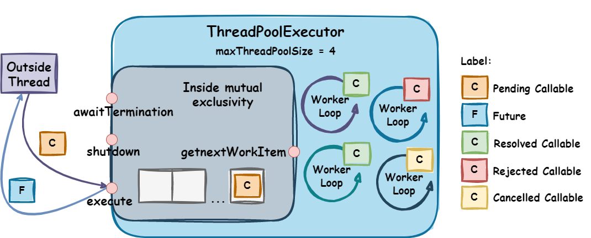 |
|:----------------------------------------------------------------------------------------------:|
|                            *ThreadPoolExcecutorWithFuture example*                             |

#### Style of synchronization
- In this synchronizer, the `Monitor Style` was used to synchronize the *worker threads*.
Each thread alters the state of the synchronizer when necessary and doesn't delegate the alteration of that state to another thread.
- Although it was used a `Request` to represent the task execution in the thread pool, that request completion
is not being delegated to another thread. Once a worker thread has received a request, it is responsible to 
complete it in any way possible.

The described `Request` is as follows:
```kotlin
private class ExecutionRequest<T>(
    val callable: Callable<T>,
    val result: Promise<T> = Promise()
)
```

### Promise
[Implementation](src/main/kotlin/pt/isel/pc/problemsets/set1/Promise.kt) | [Tests](src/test/kotlin/pt/isel/pc/problemsets/set1/PromiseTests.kt)

#### Description
In order to allow the outside threads to synchronize the result of the task execution,
the `execute` method of [ThreadPoolExecutorWithFuture](#threadpoolexecutorwithfuture) returns a 
[Future](https://docs.oracle.com/javase/8/docs/api/java/util/concurrent/Future.html) implementation.

Instead of using already existing implementations,
this executor uses its own implementation of the `Future` interface - a [Promise](https://developer.mozilla.org/en-US/docs/Web/JavaScript/Reference/Global_Objects/Promise) -
which provides a *Future* that is explicitly completed, and it can be resolved with a value, rejected with an exception or cancelled.

#### Public interface
```kotlin
class Promise<T> : Future<T> {
    override fun cancel(mayInterruptIfRunning: Boolean): Boolean
    override fun isCancelled(): Boolean
    override fun isDone(): Boolean
    @Throws(InterruptedException::class, CancellationException::class, ExecutionException::class)
    override fun get(): T
    @Throws(TimeoutException::class, InterruptedException::class, CancellationException::class, ExecutionException::class)
    override fun get(timeout: Long, unit: TimeUnit): T
    fun resolve(result: T)
    fun reject(ex: Throwable)
}
```

#### Lifecycle
The promise has a lifecycle that can be described by the following states:

|  |
|:-------------------------------------------------------------:|
|                       *Promise states*                        |

- **Pending** - the promise is pending and has not yet produced a result.
- **Resolved** - the computation has completed successfully with the given value.
- **Rejected** - the computation has completed with a failure due to an exception.
- **Cancelled** - promise was cancelled before it could be completed.

Once the *promise* is resolved, rejected or cancelled, it cannot be altered.

#### Style of synchronization
- In this synchronizer, the `Monitor Style` was used in the sense that the thread that alters the state of the promise is responsible to signal all threads that are waiting for that state to be altered for them to evaluate the state of the promise and act accordingly.

#### Normal execution:
- A thread calls `cancel`, expecting the task to be cancelled.
- A thread calls `resolve`, expecting the task to be resolved with the given value.
- A thread calls `reject`, expecting the task to be rejected with the given exception.
- A thread calls `get`, expecting to retrieve the result of the task execution.

#### Conditions of execution:
`get`:
- **Paths** - The thread can take two major paths when calling this method:
    - the task has already been completed, and as such, the thread receives the result of the task execution (**fast-path**).
    - the task has not been completed, and as such, the thread passively awaits for that condition to be met (**wait-path**).
- **Giving-up** - While waiting, a thread can *give-up* on the task execution if:
    - the thread willing-to-wait timeout expires and throws a `TimeoutException`.
    - the thread is interrupted while waiting and throws an `InterruptedException`.
- **Additional notes**: 
    - A thread that specifies a timeout of *zero* and the promise is not yet ready, it will not wait for the promise 
    to be completed and will throw a `TimeoutException`.
    - if a task has been completed:
        - but was cancelled, throws a `CancellationException`.
        - but was rejected, throws an `ExecutionException`.
        - but was resolved, returns the result of the task execution.

## Set2
### CyclicBarrier
[Implementation](src/main/kotlin/pt/isel/pc/problemsets/set2/CyclicBarrier.kt) |
[Tests](src/test/kotlin/pt/isel/pc/problemsets/set2/CyclicBarrierTests.kt)

#### Description
A [CycleBarrier](https://docs.oracle.com/javase/8/docs/api/java/util/concurrent/CyclicBarrier.html) is a synchronization mechanism
that allows a set of threads to wait for each other to reach a common barrier point.
If provided, a `Runnable` task is executed once the last thread in the set arrives at the barrier.

The barrier is called *cyclic* because it can be re-used again after being broken for the next barrier generation.

Assuming a barrier is not opened yet, it can be *broken* for the following reasons:
- A thread waiting at the barrier is interrupted.
- A thread waiting at the barrier times out while waiting.
- The barrier was resetted, and there was at least one thead waiting at the barrier.
- If the execution of the runnable by the last thread, throws an exception.  
- When a thread sets a timeout of zero and enters a non-broken barrier but does not complete it.

A new generation of the barrier is created *only* when:
- the last thread that enters the barrier and:
    - the runnable task executes successfully.
    - no runnable task was provided.
- the barrier is resetted.

#### Public interface
```kotlin
class CyclicBarrier(
    private val parties: Int,
    private val barrierAction: Runnable?,
) {
    constructor(parties: Int) : this(parties, null)
    @Throws(InterruptedException::class, BrokenBarrierException::class)
    fun await(): Int
    @Throws(InterruptedException::class, TimeoutException::class, BrokenBarrierException::class)
    fun await(timeout: Duration): Int
    fun getNumberWaiting(): Int
    fun getParties(): Int
    fun isBroken(): Boolean
    fun reset()
}
```

The barrier has the following possible states for each barrier generation.

| 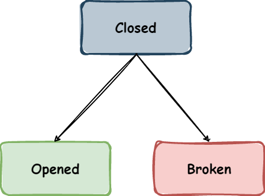 |
|:---------------------------------------------------------------------------:|
|                 *Cyclic Barrier possible generation states*                 |

#### Style of synchronization
For this synchronizer the `Kernel-style` or `Delegation of execution` was used in form of a `Request` per barrier generation,
  because it's easier
  for the last thread to enter the barrier
  to signal all threads that are waiting for the barrier to be opened and thus completing their request.

This implementation enables the barrier to be reused for the next barrier generation without affecting the prior barrier reference that the other threads have acquired before laying down their request.

As mentioned, the `CyclicBarrier` is a reusable barrier,
and as such, it is necessary to create another instance of the `Request` for the next barrier generation,
and that is done by the last thread to enter the barrier.
This thread is also responsible to execute the runnable task if it exists.
If the execution of the runnable task throws a `throwable`,
the barrier is broken and all threads waiting at the barrier are released with a `BrokenBarrierException`.

Because the threads are always signaled to leave the condition by either resetting the barrier or by opening it, the condition where all threads are waiting for the barrier to be broken is also reused in subsequent barrier generations.

The described `Request` is defined as follows:

```kotlin
private class BarrierRequest(
    var nOfThreadsWaiting: Int = 0,
    var wasBroken: Boolean = false,
    var wasOpened: Boolean = false
)
```

The following image shows a possible representation of the previous states in a barrier with 3 parties. 

| 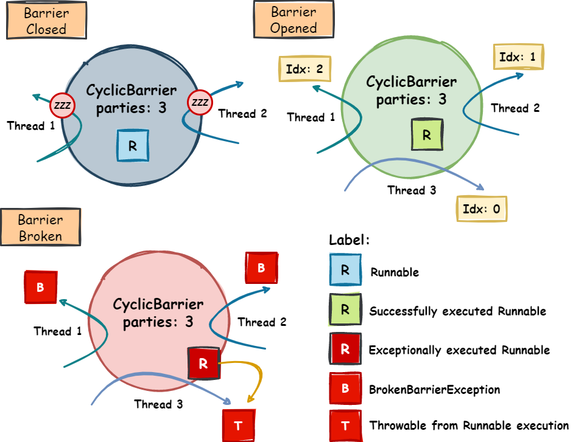 |
|:-------------------------------------------------------------:|
|                   *Cyclic Barrier example*                    |

#### Normal execution:
- A thread calls `await`, and passively awaits indefinitely for the other threads to reach the barrier, in order for it to be opened and the runnable task to be executed if it exists. Returns the arrival index of this thread where:
    - `getParties() - 1` - for first thread to enter the barrier.
    - `0` - for last thread to enter the barrier.
- A thread calls `await` (with *timeout*), and awaits for a specified timeout for the other threads to reach the barrier, with the same behavior as the previous method.
- A thread calls `reset`, and resets the barrier for the next generation.
- A thread calls `getNumberWaiting`, and retrieves the number of threads that are waiting for the barrier to be opened.
- A thread calls `getParties`, and retrieves the number of threads that must invoke `await` in order for the barrier to be opened.
- A thread calls `isBroken`, and retrieves information about whether the barrier has been broken or not.

#### Conditions of execution:
`await`:
- **Paths** - The thread can take three major paths when calling this method:
    - **fast-path** 
        - the current barrier has already been broken, and as such, the thread throws a `BrokenBarrierException`.
        - the barrier has not yet been broken, and this thread is the last one to enter the barrier:
            - if a runnable task was provided and its execution throws a `throwable`, the barrier is broken, and all threads waiting at the barrier are released with a `BrokenBarrierException`, and the thread returns the same `throwable`.
            - if a runnable task was not provided, or its execution completes successfully, the barrier is opened, a new generation is created, and the thread returns `0`.
        - A thread that specifies a timeout of *zero* and does not complete the barrier will not wait for that event and throws a `TimeoutException` immediately.
    - **wait-path**
        - the barrier has not yet been broken, and this thread is not the last one to enter the barrier, and as such, the thread passively awaits for that condition to be met. 
- **Giving-up** - While waiting for the barrier to be opened, a thread can *give-up* in the following cases:
    - the thread is interrupted and, as such, throws an `InterruptedException`, ***if and only if*** it was the first thread to be interrupted out of all the threads waiting for the barrier to be broken.
    - the thread is interrupted, and if the barrier was already broken by another thread, throws a `BrokenBarrierException`.
    - the thread timeout expires and throws a `TimeoutException`.

### ThreadSafeContainer
[Implementation](src/main/kotlin/pt/isel/pc/problemsets/set2/ThreadSafeContainer.kt) |
[Tests](src/test/kotlin/pt/isel/pc/problemsets/set2/ThreadSafeContainerTests.kt)

#### Description
A thread-safe container is a container that allows multiple threads to consume the values it 
contains using the `consume` method.

The container receives an array of [AtomicConsumableValue](src/main/kotlin/pt/isel/pc/problemsets/set2/AtomicConsumableValue.kt)s,
that cannot be empty.
Each value has a number of lives that represent the number of times that value can be consumed by a thread.

A thread that consumes a value from the container
decreases the number of lives of that value by one or returns `null` if the container has no values left to consume.

When multiple threads try to consume a value from the container at the same time,
there's no guarantee which thread will consume the life of that value first.
Also,
a thread that tries to consume a value from a non-empty container could possibly never consume a value
if it keeps losing the race against other threads
that are also trying to the same, which could mean that the container might be emptied by other threads before it can consume a value.
Although this is relevant to mention, it is not a problem because the container was not specified to be *fair*.
This event does not lead to *starvation* because the thread will return `null` and will not be blocked indefinitely.

#### Public interface
```kotlin
class ThreadSafeContainer<T>(
    private val values: Array<AtomicConsumableValue<T>>
) {
    fun consume(): T
}
```

The following images illustrate the state of the container before and after a set of threads consume values from it,
as well as how a value is represented.

| 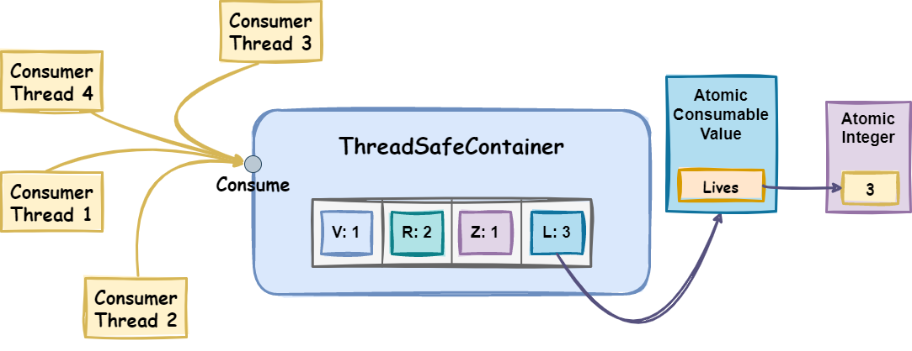 |
|:-----------------------------------------------------------------------------------------------------------------:|
|  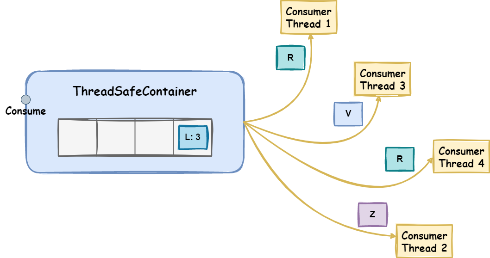  |
|                                          *Thread-Safe Container example*                                          |

#### Style of synchronization
The implementation uses a lock-free *retry* style of synchronization,
where a thread that fails to consume a value from the container will retry until possible.

In the implementation,
both the `index` of the array of values and the `lives` property of each `value` were needed to be
updated atomically, and therefore both are represented by an [AtomicInteger](https://docs.oracle.com/javase/8/docs/api/java/util/concurrent/atomic/AtomicInteger.html). 

An implementation that is not *thread-safe*, and that was the starting point of this implementation, can be seen [here](src/main/kotlin/pt/isel/pc/problemsets/unsafe/UnsafeContainer.kt).

#### Normal execution:
- A thread calls `consume`, and consumes a value from the container, if there is any left or returns `null` if 
the container is empty.

#### Conditions of execution:
`consume`:
- **Paths** - The thread can take two major paths when calling this method:
    - **fast-path**
        - the container has no values left to consume, and as such, null is returned.
    - **outer-retry-path**
        - the container has values left to consume, so the thread tries to decrement a life from the current index 
          value until possible. This action is associated with an **inner-retry-path**, because the thread will keep trying 
          to decrement the life of the current value until it is not possible, because some other thread(s) decremented all 
          lives of this value and as such, this thread is forced to leave to the **outer-retry-path**. Back to the outer loop,
          the thread tries to decrement a life of the next value in the array if it exists, or returns null if the array was 
          emptied in the meantime.

### ThreadSafeCountedHolder
[Implementation](src/main/kotlin/pt/isel/pc/problemsets/set2/ThreadSafeCountedHolder.kt) |
[Tests](src/test/kotlin/pt/isel/pc/problemsets/set2/ThreadSafeCountedHolderTests.kt)

#### Description
A thread-safe-counted holder is a container
that holds a resource `value` that internally has a `counter` that specifies how many times the value was used.
If the counter reaches zero, the value is automatically *closed*, and since it implements the 
[Closeable](https://docs.oracle.com/javase/8/docs/api/java/io/Closeable.html) interface, it can be closed 
by calling the `close` method.

#### Public interface
```kotlin
class ThreadSafeCountedHolder<T : Closeable>(value: T) {
    fun tryStartUse(): T?
    @Throws(IllegalStateException::class)
    fun endUse()
}
```

The following images illustrate the state of the holder when a thread tries to use the value that is not closed,
and after a thread decrements the usage counter of the value, and the counter reaches zero.

|         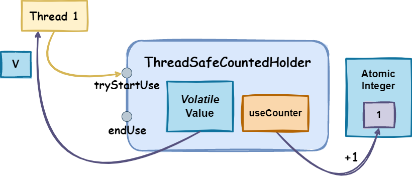         |
|:---------------------------------------------------------------------------------------------------------------------:|
| 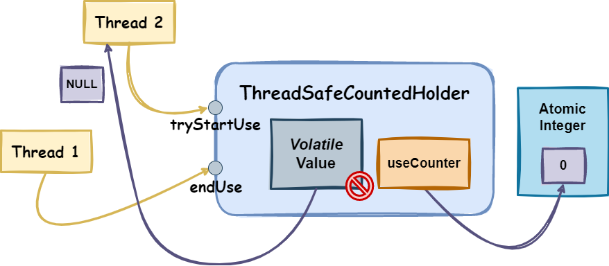 |
|                                         *Thread-Safe Counted Holder example*                                          |

#### Style of synchronization
The implementation uses a lock-free *retry* style of synchronization,
where a thread that fails to increment/decrement the usage counter of the value will retry until possible.

The `usage counter` is incremented/decremented
atomically using the [AtomicInteger](https://docs.oracle.com/javase/8/docs/api/java/util/concurrent/atomic/AtomicInteger.html) class
while the `value` itself was considered to be *volatile* and not atomic, as it provides the necessary guarantees of 
thread-safety and visibility without incurring unnecessary overhead.

An implementation that is not thread-safe, and that was the starting point of this implementation,
can be seen [here](src/main/kotlin/pt/isel/pc/problemsets/unsafe/UnsafeUsageCountedHolder.kt).

#### Normal execution:
- A thread calls `tryStartUse`, and retrieves the value if it is not closed, incrementing the usage counter.
- A thread calls `endUse`, and decrements the usage counter of the value, closing it if the counter reaches zero.

#### Conditions of execution:
`tryStartUse`:
- **Paths** - The thread can take two major paths when calling this method:
    - **fast-path**
        - the `value` is already `null`, which means the resource was closed, and as such, null is returned (cannot be reused).
    - **retry-path**
        - the `value` is not closed, so this thread tries to increment the usage counter if possible, and if it is, returns the `value`.
        - while trying to increment the usage counter, the threads see that the counter is zero, indicating that some other thread closed the resource, this thread returns `null`.
      
`endUse`:
- **Paths** - The thread can take two major paths when calling this method:
    - **fast-path**
        - the `value` is already null, since it was closed, and as such, `IllegalStateException` is thrown.
    - **retry-path**
        - the `value` is not closed, so this thread tries to decrement the usage counter if possible, and if it is, returns immediately.
        - while trying to decrement the usage counter, if the threads see that the counter reached zero, indicating that some other thread closed the resource, this thread throws `IllegalStateException`.
        - if the thread that decrements the usage counter sees the counter reaching zero, the thread closes the resource and sets the `value` to null.

### LockFreeCompletionCombinator
[Implementation](src/main/kotlin/pt/isel/pc/problemsets/set2/LockFreeCompletionCombinator.kt) |
[Tests](src/test/kotlin/pt/isel/pc/problemsets/set2/CompletionCombinatorTests.kt)

#### Description
A [CompletionCombinator](src/main/kotlin/pt/isel/pc/problemsets/sync/combinator/CompletionCombinator.kt)
that minimizes the usage of locks to synchronize access to shared state. It provides similar functionalities as the [Promise.all](https://developer.mozilla.org/en-US/docs/Web/JavaScript/Reference/Global_Objects/Promise/all) and [Promise.any](https://developer.mozilla.org/en-US/docs/Web/JavaScript/Reference/Global_Objects/Promise/any) combinators of the [JavaScript Promise API](https://developer.mozilla.org/en-US/docs/Web/JavaScript/Reference/Global_Objects/Promise).

#### Public interface
```kotlin
class LockFreeCompletionCombinator : CompletionCombinator {
    @Throws(IllegalArgumentException::class)
    override fun <T> all(inputStages: List<CompletionStage<T>>): CompletionStage<List<T>>
    @Throws(IllegalArgumentException::class)
    override fun <T> any(inputStages: List<CompletionStage<T>>): CompletionStage<T>
}
```

The following image illustrates the combinators respective possible output when a list of `CompletableFutures` is provided.

| 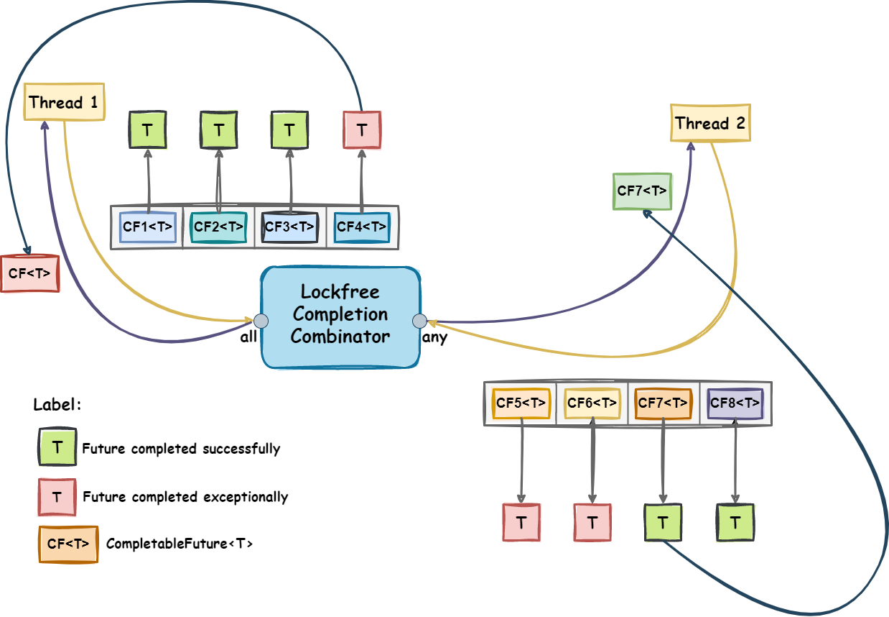 |
|:-----------------------------------------------------------------------------------------------:|
|                            *Lock-free Completion Combinator example*                            |

#### Style of synchronization
The implementation uses a lock-free *retry* style of synchronization,
where a thread that sees a change of state will try to update the state of the combinator until it can
or sees that the state has already been updated by another thread.

The combinators implementation uses the [TreiberStack](src/main/kotlin/pt/isel/pc/problemsets/sync/lockfree/TreiberStack.kt) data structure, which is a lock-free stack.
A `toList` method was added to this stack to return a list of the elements in it. The method was also designed to be lock-free,
although it will always provide a *snapshot* of the stack at the time of the call
and cannot guarantee the current state of the stack did not change after the call.

An implementation that is *lock-based*,
and that was the starting point of this implementation,
and the motive for the creation of the already mentioned `CompletionCombinator` interface,
is available [here](src/main/kotlin/pt/isel/pc/problemsets/sync/lockbased/LockBasedCompletionCombinator.kt).

An example of a *lock-based* and a *lock-free* implementations can be consulted in this [section](#lock-based-vs-lock-free-algorithms).

#### AggregationError
The [AggregationError](src/main/kotlin/pt/isel/pc/problemsets/sync/combinator/AggregationError.kt) is a custom exception
that is thrown when the `any` combinator is called and **all** of the input stages fail,
similar to the [AggregateError](https://developer.mozilla.org/en-US/docs/Web/JavaScript/Reference/Global_Objects/AggregateError) in JavaScript.

It contains a list of the exceptions that caused the failure of the input stages as a property.

```kotlin
class AggregationError(
    message: String,
    causes: List<Throwable>
) : Error(message) {
    val throwables: List<Throwable> by lazy(LazyThreadSafetyMode.PUBLICATION) { causes }
}
```

It was deemed necessary to provide a property
that returns a list of exceptions that caused the failure of each input stage.
To achieve this,
the property was implemented as a [lazy](https://kotlinlang.org/docs/delegated-properties.html#lazy-properties) property,
meaning the list is only created if and when the property is called.

Additionally, `LazyThreadSafetyMode.PUBLICATION` was used to ensure that the list is created only once,
even if multiple initializations occur concurrently.

#### Normal Execution
- A thread calls the `all` method and passes a list of `CompletionStage` implementations, expecting a list of input stages as a result.
- A thread calls the `any` method and passes a list of `CompletionStage` implementations, expecting a single input stage as a result.

#### Conditions of execution
`all`: 
- For all input stages in this combinator, a handler was added to each stage, that executes when the stage
completes, and in that handler a few paths can be associated:
    - **fast-path**
        - the entire list of input stages was already added to the `futureToReturn` that is returned by
      this combinator, so this thread returns immediately.
    - **retry-path-on-failure**
        - the `futureToReturn` is not yet complete, and this thread sees the stage completed
      exceptionally, and as such it tries to mark the `futureToReturn` as *completed*, but enters a retry
      cycle since another thread might have already done that in the meantime. If the thread is successful
      in marking the `futureToReturn` as *completed*, it will complete it exceptionally with the exception
      that caused the failure of the input stage and return.
    - **retry-path-on-success**
        - the `futureToReturn` is not yet complete, and this thread sees that all stages completed
      succesfully, and as such it tries to mark the `futureToReturn` as *completed*, 
      but enters a retry cycle since another thread might have done that in the meantime. 
      If the thread is successful in marking the `futureToReturn` as *completed*, it will complete
      it successfully with the list of results and return. 

`any`:
- For all input stages in this combinator, a handler was added to each stage, that executes when the 
stage completes, and in that handler a few paths can be associated:
    - **fast-path**
        - the `futureToReturn` that is returned by this combinator was already completed, so this thread
      returns immediately.
    - **retry-path-on-success**
        - the `futureToReturn` is not yet complete, and this thread sees that the stage associated with
      the handler completed succesfully, and as such it tries to mark the `futureToReturn` as *completed*,
      but enters a retry cycle since another thread might have done that in the meantime.
      If the thread is successful in marking the `futureToReturn` as *completed*,
      it will complete it successfully with the result of the input stage and return.
    - **retry-path-on-failure**
        - the `futureToReturn` is not yet complete, and this thread sees that all stages completed
      exceptionally, and as such it tries to mark the `futureToReturn` as *completed*, but enters a 
      retry cycle since another thread might have already done that in the meantime. If the thread
      is successful in marking the `futureToReturn` as *completed*, it will complete it exceptionally
      with an `AggregationError` containing a list of the exceptions that caused the failure of each 
      input stage and return.

### Monitor style vs Kernel style
In the `Monitor-style` of synchronization, the thread that creates favorable conditions for other threads to advance
to the next state signals those threads.
It is the responsibility of those other threads to complete their own request of sorts after they exit the condition
where they were waiting upon.

In the `Kernel-style` or `Delegation of execution`,
the thread that creates favorable conditions for other threads to advance to the next state is responsible
for completing the requests of those other threads.
In successful cases,
the threads in the dormant state that were signaled do not have
to do anything besides confirming that their request was completed and return immediately from the synchronizer.
This style of synchronization is usually associated with one or more requests
that a thread or threads want to see completed,
and they delegate that completion to another thread, while keeping a local reference to that request, which then enables
the synchronizer to resume its functions without waiting for said requests to be completed. 

For general purpose, the kernel-style is the preferred one, 
since it is more flexible and easier to implement, but the choice will always be dependent
on the context of the synchronization problem.

### Lock-based vs Lock-free algorithms
The lock-based algorithms use a `lock` to ensure that only one thread can access the shared state at a given time.

#### Intrinsic vs Explicit locks
- synchronized blocks (*intrinsic lock*)
    ```kotlin
    synchronized(lock) {
       // code to be synchronized
    }
    ```
- synchronized methods (*intrinsic lock*)
    ```kotlin
    @Synchronized 
    fun method() {
        // code to be synchronized
    }
    ```
- ReetrantLock (*explicit lock*)
    ```kotlin
    // Or any other Lock interface implementation
    val lock: Lock = ReentrantLock()
    fun method() = lock.withLock {
        // code to be synchronized
    }
    ```
Meanwhile, the lock-free algorithms are based on atomic operations that ensure that multiple threads can access shared state concurrently without interfering with each other. 
This allows for efficient concurrent access without the overhead and potential contention of locking mechanisms.
Most algorithms use atomic variables and retry loops to achieve this.

#### Volatile vs Atomic
When a variable is marked as `volatile`, any *write* to that variable is immediately visible to all other threads,
and any *read* of that variable is guaranteed to see the most recent write
(*[happens-before relation](https://docs.oracle.com/javase/specs/jls/se8/html/jls-17.html#jls-17.4.5)*).
The guarantee of visibility is only for the variable itself,
not for the state of the object it refers to or any other variables.
This is guaranteed by the [Java Memory model](https://docs.oracle.com/javase/specs/jls/se8/html/jls-17.html),
which is then implemented by the `Java Virtual Machine`.

```kotlin
@Volatile var sharedState: Any = Any()
```

[Atomic](https://docs.oracle.com/javase/8/docs/api/index.html?java/util/concurrent/atomic/package-summary.html) variables 
are implicitly *volatile* and guarantee atomicity of operations on them.

Some examples of atomic variables are `AtomicInteger`, `AtomicBoolean` and `AtomicReference`.
These variables have special methods for atomic operations, like `compare-and-set` which guarantee that their state will always
be consistent and synchronized between threads.

```kotlin
val sharedState: AtomicReference<Any> = AtomicReference(Any())
```

| 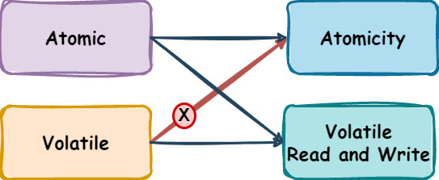 |
|:---------------------------------------------------------------------:|
|                         *Volatile vs Atomic*                          | 

#### Implementations
An example of a lock-based and a lock-free implementation of a business logic
that updates a shared state can be seen in the following code snippets:

```kotlin
object LockBasedImplementation {
    val lock: Lock = ReentrantLock()
    var sharedState: Any = Any()
    fun updateState() = lock.withLock {
        logic(sharedState)
    }
}
```

```kotlin
object LockFreeImplementation {
    val sharedState: AtomicReference<Any> = AtomicReference(Any())
    fun updateState() {
        while (true) {
            val observedState = sharedState.get()
            val nextState = if (condition) {
                logic(observedState)
            } else {
                failureLogic()
            }
            // applies the next state to the shared state if the observed 
            // value corresponds to the value present in the shared state
            if (sharedState.compareAndSet(observedState, nextState)) {
                successLogic()
                return // or any other exit condition of the retry loop when done
            }
            // retry
        }
    }
}
```